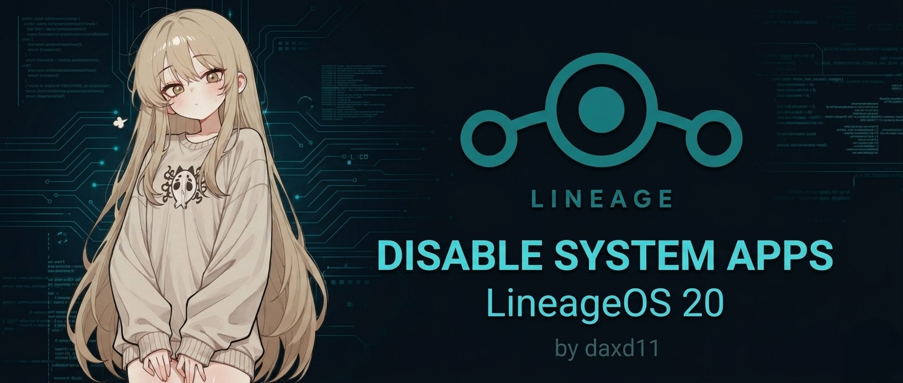

# Disable System Apps for LineageOS 20

## Project Overview
This module is specifically designed to optimize system performance by disabling unnecessary packages from LineageOS 20. It focuses on maintaining system stability while reducing background processes and storage usage.

### Requirements
- **Kernel:** This module **requires** [KernelSU Next](https://github.com/rifsxd/KernelSU-Next) to function properly.
- **Resources:** The compatible kernel has been provided directly in the **daxd community** posting.

### Device Specifications
- **Target Device:** Redmi 10 & 2022
- **OS Version:** Android 13
- **Rom Type:** Custom ROM (LineageOS 20)
- **Maintainer:** [@daxd11](https://github.com/daxd11)

### Uninstallation
To restore all disabled applications and return the system to its original state, simply uninstall this module from your manager and reboot your device.

---

## Disabled Packages List
Below is the comprehensive list of 125 packages disabled in this module for a cleaner experience:

Click to expand the full list of 125 packages

1. com.android.internal.systemui.navbar.twobutton
2. com.google.android.feedback
3. com.google.android.marvin.talkback
4. com.android.adservices.api
5. com.google.android.projection.gearhead
6. com.android.egg
7. com.google.android.apps.restore
8. com.android.carrierdefaultapp
9. org.lineageos.audiofx
10. org.lineageos.overlay.customization.blacktheme
11. com.miui.extraphoto
12. com.android.bookmarkprovider
13. org.lineageos.jelly
14. com.android.calllogbackup
15. com.android.cameraextensions
16. com.android.theme.icon_pack.circular.settings
17. com.android.theme.icon_pack.circular.systemui
18. com.android.theme.icon_pack.circular.launcher
19. com.android.theme.icon_pack.circular.android
20. com.android.backupconfirm
21. com.android.carrierconfig
22. com.android.carrierconfig.selene
23. com.android.dialer.auto_generated_rro_product__
24. com.android.dialer.overlay.selene
25. com.android.documentsui.overlay
26. com.android.emergency.auto_generated_rro_product__
27. com.android.frameworksres.overlay.selene
28. com.android.imsserviceentitlement.auto_generated_rro_product__
29. com.android.inputmethod.latin.auto_generated_rro_product__
30. com.android.launcher3.auto_generated_rro_product__
31. com.android.launcher3.overlay
32. com.android.managedprovisioning.auto_generated_rro_product__
33. com.android.nearby.halfsheet
34. com.android.networkstack.tethering.selene
35. com.android.ondevicepersonalization.services
36. com.android.providers.settings.auto_generated_rro_product__
37. com.android.settings.overlay.selene
38. com.android.settingsprovider.overlay.selene
39. com.android.sharedstoragebackup
40. com.android.storagemanager.auto_generated_rro_product__
41. com.android.systemui.overlay.selene
42. com.android.systemui.plugin.globalactions.wallet
43. com.android.telephony.overlay.selene
44. com.android.wallpaperbackup
45. com.mtg.gmsoverlay
46. com.mtg.gmssettingsprovideroverlay
47. com.android.dynsystem
48. com.android.theme.icon_pack.filled.settings
49. com.android.theme.icon_pack.filled.systemui
50. com.android.theme.icon_pack.filled.android
51. com.android.theme.icon_pack.filled.launcher
52. com.android.internal.systemui.navbar.gestural_wide_back
53. com.android.internal.systemui.navbar.gestural_extra_wide_back
54. com.android.internal.systemui.navbar.gestural
55. com.android.internal.systemui.navbar.gestural_narrow_back
56. com.google.android.googlequicksearchbox
57. com.android.emergency
58. com.android.theme.icon_pack.kai.settings
59. com.android.theme.icon_pack.kai.systemui
60. com.android.theme.icon_pack.kai.android
61. com.android.theme.icon_pack.kai.launcher
62. org.lineageos.etar
63. com.android.calculator2
64. com.android.providers.userdictionary
65. com.android.dreams.basic
66. org.lineageos.overlay.font.lato
67. com.android.bips
68. com.google.android.gm.exchange
69. com.android.nfc
70. lineageos.platform.auto_generated_rro_product__
71. org.calyxos.backup.contacts
72. org.lineageos.eleven
73. com.android.theme.font.notoserifsource
74. org.lineageos.lineageparts.auto_generated_rro_product__
75. org.lineageos.lineagesettings.auto_generated_rro_product__
76. org.lineageos.overlay.customization.navbar.nohint
77. org.lineageos.setupwizard.auto_generated_rro_product__
78. org.lineageos.updater.auto_generated_rro_product__
79. org.protonaosp.deviceconfig.auto_generated_rro_product__
80. org.lineageos.setupwizard
81. com.android.theme.icon.pebble
82. org.lineageos.updater
83. com.android.wallpaper.livepicker
84. com.android.htmlviewer
85. com.google.android.setupwizard
86. com.android.managedprovisioning
87. com.android.inputdevices
88. org.lineageos.recorder
89. com.android.cellbroadcastreceiver.module
90. com.android.internal.display.cutout.emulation.double
91. com.android.internal.display.cutout.emulation.hole
92. com.android.internal.display.cutout.emulation.corner
93. com.android.internal.display.cutout.emulation.tall
94. com.android.internal.display.cutout.emulation.waterfall
95. com.android.printservice.recommendation
96. com.android.printspooler
97. org.lineageos.profiles
98. com.android.theme.icon_pack.rounded.systemui
99. com.android.theme.icon_pack.rounded.android
100. com.android.theme.icon_pack.rounded.launcher
101. com.android.theme.icon_pack.rounded.settings
102. com.android.theme.icon.roundedrect
103. org.lineageos.overlay.font.rubik
104. com.android.theme.icon_pack.sam.settings
105. com.android.theme.icon_pack.sam.systemui
106. com.android.theme.icon_pack.sam.android
107. com.android.theme.icon_pack.sam.launcher
108. com.android.dreams.phototable
109. com.stevesoltys.seedvault
110. com.android.stk
111. org.protonaosp.deviceconfig
112. org.lineageos.settingsconfig
113. com.tencent.soter.soterserver
114. com.google.android.tts
115. com.android.theme.icon.square
116. com.android.theme.icon.squircle
117. com.android.theme.icon.taperedrect
118. com.android.theme.icon.teardrop
119. com.android.customization.themes
120. com.android.theme.icon.vessel
121. com.android.theme.icon_pack.victor.settings
122. com.android.theme.icon_pack.victor.systemui
123. com.android.theme.icon_pack.victor.launcher
124. com.android.theme.icon_pack.victor.android
125. org.lineageos.backgrounds

---

## Join Our Community
Get the latest updates, troubleshooting help, and connect with other users:

---
*Disclaimer: Use this at your own risk. Disabling system packages may affect certain functionalities depending on your usage.*
